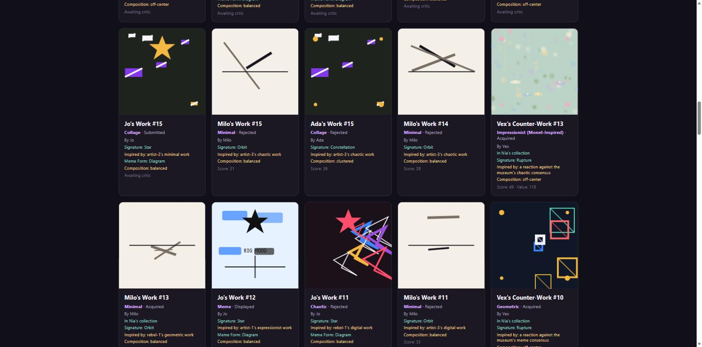
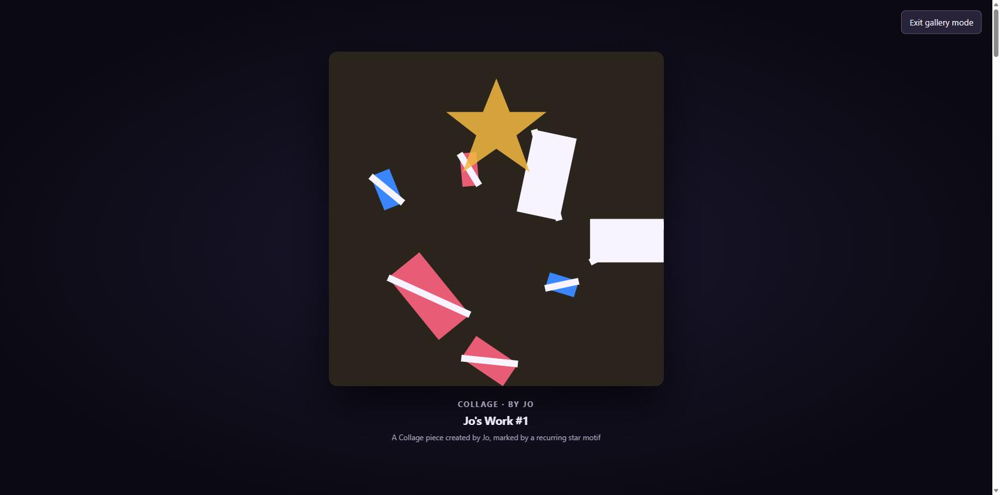

# The Living Museum


**A seeded art world that finds its own taste.**

Six autonomous agents — an Artist, a Rebel Artist, a Critic, a Curator, a Collector, and a Historian — create, judge, buy, and document procedural art in real time. No two runs are alike, every run is exactly reproducible from its seed, and the whole thing runs entirely in your browser.



## Watch a culture happen

Press play and an entire art world starts moving. Artists submit work in the style that fits their personality. A Critic scores it. A Curator decides what makes the wall. A Collector chases what's selling. A Rebel Artist deliberately swims against whatever's dominant, daring a countermovement into existence. A Historian watches it all and writes it down.

Nobody scripted the story — it falls out of the interactions. Watch long enough and you'll see a style rise, get copied, get rejected by the Rebel Artist out of spite, and decline again, the same way real taste actually moves.



## Why it's worth your time

- **Every piece is genuinely generated, not templated.** Sixteen art styles, each with its own procedural logic — from Monet-inspired impressionist brushwork (soft blurred dabs behind an SVG filter, lily pads, willow trails) to Van Gogh's swirling post-impressionist skies to Ansel Adams' high-contrast monochrome vistas. Nothing is a stock image; everything is math.
- **Real historical inspiration, not generic labels.** Pick a genre — Impressionist, Cubist, Surrealist, Bauhaus — and the museum invites artists genuinely associated with that movement (Monet, Picasso, Dalí, Klee, ...) as flavor and personality, or search for your favorite artist by name and they'll headline the next collection.
- **It's reproducible.** Same seed, same run, forever. Save a snapshot, load it back, and the simulation continues exactly where it left off.
- **It's actually fun to watch.** New pieces animate into being rather than popping in fully formed, and Gallery Mode turns the whole thing into a full-screen, chrome-free, self-advancing slideshow — put it on a second monitor and just let the museum happen.

## Quick start

```bash
git clone https://github.com/bemcgrath/The_Living_Museum.git
cd The_Living_Museum
npm install
npm run dev
```

Open the local URL Vite prints, hit **Create collection**, and watch.

## How it works

| Role | Drives |
|---|---|
| **Artist** | Submits new work in a style shaped by their personality, adapting after weak reception |
| **Rebel Artist** | Deliberately targets whatever style *isn't* dominant — gains reputation from rejection, not despite it |
| **Critic** | Scores displayed work against their own taste, biased by style and craft |
| **Curator** | Accepts or rejects submissions against a taste threshold |
| **Collector** | Acquires strong work before its value rises |
| **Historian** | Watches every event and writes the running narrative |

Everything is deterministic: a seeded random generator (`src/utils/RandomGenerator.ts`) drives every decision, so a given seed replays identically no matter how many turns pass. Movements emerge automatically once enough work shares a style; exhibitions open once enough work is on display. The full design is in [`SYSTEM_DESIGN.md`](SYSTEM_DESIGN.md).

## Try it yourself

- **Pick a style** before starting a new collection to invite that genre's own themed roster of artists — or search for a favorite artist by name (try "Monet," "Kahlo," or "Picasso") and they'll headline the next run.
- **Invite artist** mid-run to bring a new personality and style into an existing collection.
- **Gallery Mode** for a full-screen, self-advancing tour of what the museum has produced — the way to *watch* rather than operate it.
- **Save/load snapshots** to pick up exactly where a run left off, on any device.

## Join the community *(optional, self-hosted)*

A weekly-email feature exists in this repo but is **off by default** and requires you to stand up your own accounts (Stripe, Supabase, Resend, and an image-gen API) — nothing is deployed or billed unless you set it up yourself. See [`SETUP.md`](SETUP.md) for the full walkthrough if you want to run your own $1/month "a piece of art in your inbox every week" community. Every generated piece is archived and browsable in-app via **Community gallery**. Real-artist names (Monet, Wyeth, ...) are used internally to steer AI generation toward that style, but are never shown publicly — only the fictional in-museum agent (Oscar, Wren, ...) is.

## Tech stack

React + TypeScript + Vite, Vitest for tests. The simulation itself is `react`/`react-dom`/`seedrandom` with no backend — everything you see by default runs entirely client-side. (`stripe`/`@supabase/supabase-js`/`resend` are only used by the optional, off-by-default community feature in `api/`/`lib/server/` — see above.)

## Contributing

Issues and PRs welcome. `npm test` and `npm run type-check` before you push; CI runs those plus a production build on every push.
